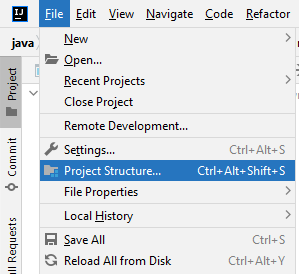
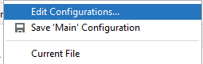
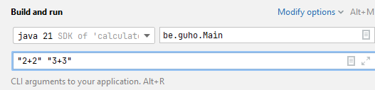

# Implémentation Java

Pour plus de facilité, il est nécéssaire d'avoir le JDK 21 et d’utiliser **IntelliJ**, dont la licence est gratuite avec un compte UMons. Sinon, un essai gratuit de 30 jours est disponible.

La première étape consiste à télécharger ou cloner le dépôt. Deux options sont possibles :
- Cliquer sur le bouton vert en haut à droite ```<> Code``` puis ```Download ZIP```.
- Ou utiliser git : ``` git clone https://github.com/guillaumehx/memoire-implementation-java.git ```

## Windows
### 1. Setup
Ouvrez un ``cmd`` à la racine et vérifiez que Java 21 n'est pas déjà installé en lançant la commande : ```java --version```
- Si rien ne s'affiche ou que la version n'est pas la bonne, rendez-vous sur le site https://www.oracle.com/be/java/technologies/downloads/#jdk21-windows et téléchargez le JDK.

Ensuite téléchargez IntelliJ : https://www.jetbrains.com/idea/download/?section=windows

Ouvrez ensuite le projet en sélectionnant le dossier à l’aide de :  
`File > Open...` (ou simplement `Open` depuis l’écran d’accueil), et choisissez le dossier du projet.

Une fois le projet importé dans IntelliJ, il faut :
S'assurer que le JDK 21 est bien intégré dans l'éditeur de la sorte : ```File > Project Structure``` :\


Une fenêtre s'ouvre et sur la gauche il faut aller dans ```Project``` puis choisir le JDK 21 dans la partie ```SDK``` :\


### 2. Exécution

Pour exécuter le programme, localisez la classe ```Main``` dans l'arborescence à gauche, faites un clic droit dessus puis ```Run 'Main.main()'```.

Vous pouvez aussi modifier la classe ```Main``` pour mettre votre expression arithmétique, ou bien passer des arguments :
Cliquez en haut à droite sur ```Main``` :\


Puis cliquez sur ```Edit configurations``` :\


Puis mettez vos expressions dans ```Program arguments``` séparés par un espace :\


Pour exécuter les tests, rendez-vous dans le package ``test/java/be/guho/`` puis faites un clique droit sur ce package et ``Run 'Tests in 'guho'''`` :\


## macOS
### 1. Setup
Ouvrez un terminal à la racine et vérifiez que Java 21 n'est pas déjà installé en lançant la commande : ```java --version```
- Si rien ne s'affiche ou que la version n'est pas la bonne, rendez-vous sur le site https://www.oracle.com/be/java/technologies/downloads/#jdk21-mac et téléchargez un JDK.

Ensuite téléchargez IntelliJ : https://www.jetbrains.com/idea/download/?section=mac

Ouvrez ensuite le projet en sélectionnant le dossier à l’aide de :  
`File > Open...` (ou simplement `Open` depuis l’écran d’accueil), et choisissez le dossier du projet.

Une fois le projet importé dans IntelliJ, il faut :
S'assurer que le JDK 21 est bien intégré dans l'éditeur de la sorte : ```File > Project Structure``` :\


Une fenêtre s'ouvre et sur la gauche il faut aller dans ```Project``` puis choisir le JDK 21 dans la partie ```SDK``` :\


### 2. Exécution

Pour exécuter le programme, localisez la classe ```Main``` dans l'arborescence à gauche, faites un clic droit dessus puis ```Run 'Main.main()'```.

Vous pouvez aussi modifier la classe ```Main``` pour mettre votre expression arithmétique, ou bien passer des arguments :
Cliquez en haut à droite sur ```Main``` :\


Puis cliquez sur ```Edit configurations``` :\


Puis mettez vos expressions dans ```Program arguments``` séparés par un espace :\


Pour exécuter les tests, rendez-vous dans le package ``test/java/be/guho/`` puis faites un clique droit sur ce package et ``Run 'Tests in 'guho'''`` :\


## Linux
### 1. Setup
Avec Linux, il est plus simple de le faire en ligne de commande. Ouvrez un terminal à la racine et vérifiez que le JDK 21 n'est pas déjà installé en lançant la commande : ```java --version```

- Si rien ne s'affiche ou que la version n'est pas la bonne, lancez la commande suivante : ```sudo apt install -y openjdk-21-jdk```

Dans ce même terminal vérifiez que maven 3 n'est pas déjà installé en lançant la commande : ```mvn -version```

- Si maven n'est pas installé ou si la version n'est pas la bonne, lancez la commande suivante : ```sudo apt install -y maven```

### 2. Exécution

Pour exécuter le programme, ouvrez un terminal à la racine du projet, puis lancez la commande suivante pour compiler le code : ```mvn compile``` puis ``` mvn exec:java -Dexec.mainClass="be.guho.Main" -Dexec.args="<ARGUMENT>"``` en remplacent ```<ARGUMENT>``` par une expression arithmétique, par exemple ```6+2*(10/5)``` et l'output sera ```10```.
Vous pouvez chaîner les arguments par un espace : ```mvn exec:java -Dexec.mainClass="be.guho.Main" -Dexec.args="6+2*(10/5) 2+2 8-5^2"``` L'output sera alors
~~~~
10
4
-17
~~~~

Pour exécuter les tests, lancez la commande ``mvn test``

⚠️ Notez que si vous modifiez le code, il faudra refaire les étapes précédentes à chaque fois.
